<div align="center">

<!-- Header with Wave Animation -->


<!-- Animated Typing Text -->
<div align="center">
  
</div>

<!-- Badges Row -->
<p align="center">
  
  
  
  
</p>

<!-- Social Links with Hover Effect -->
<p align="center">
  <a href="https://linkedin.com/in/pasindu-basnayaka">
    
  </a>
  <a href="https://pasindu-sankalpa-basnayaka.netlify.app/">
    
  </a>
  <a href="mailto:pasindusanke0303@gmail.com">
    
  </a>
  <a href="https://instagram.com/sankalpa0303">
    
  </a>
  <a href="https://fb.com/pasindu%20sankalpa%20basnayaka">
    
  </a>
  <a href="https://www.youtube.com/c/pasindu%20sankalpa%20basnayaka">
    
  </a>
</p>

</div>

<br>

<!-- Fancy Divider -->


<br>

##  About Me


```typescript
const pasindu = {
    code: ["Python", "Java", "JavaScript", "C++", "SQL"],
    
    technologies: {
        dataScience: {
            libraries: ["Pandas", "NumPy", "Scikit-Learn"],
            visualization: ["Matplotlib", "Seaborn", "Plotly"],
            ml: ["TensorFlow", "Keras", "PyTorch"]
        },
        webDev: {
            frontend: ["React", "HTML5", "CSS3", "Tailwind"],
            backend: ["Node.js", "Express", "Spring"],
        },
        databases: ["MySQL", "MongoDB", "Oracle"],
        devOps: ["Docker", "AWS", "Git", "Linux"],
        tools: ["Postman", "Figma", "VS Code"]
    },
    
    currentFocus: "Building AI-powered solutions 🤖",
    funFact: "I turn coffee into algorithms ☕️➡️📊"
};
```

<br clear="right"/>

### 🎯 Quick Highlights

- 🔭 **Current Project:** [AI Chatbot using Gemini API](https://github.com/sankalpa0303/AI-Chatbot-using-Gemini-API-MERN-.git)
- 🌱 **Learning:** Advanced Machine Learning, Deep Learning, Data Engineering
- 👯 **Collaborate:** Data Science, ML Projects, Analytics Solutions
- 🎓 **Education:** Data Science Student passionate about AI
- 💡 **Expertise:** Data Analysis | Python | SQL | Machine Learning | Visualization
- 🎯 **Goal:** Become a world-class Data Scientist and AI Engineer
- ⚡ **Fun Fact:** I enjoy finding patterns in messy data 📊😄

<br>

<!-- Divider -->


<br>

## 🏆 GitHub Trophies

<div align="center">
  
</div>

<br>

<!-- Divider -->


<br>

## 🚀 Tech Stack & Tools

<div align="center">

### 💻 Programming Languages
<p>
  
  
  
  
  
  
  
  
</p>

### 📊 Data Science & Machine Learning
<p>
  
  
  
  
  
  
  
  
  
  
</p>

### 🌐 Web Development
<p>
  
  
  
  
  
  
  
</p>

### 🗄️ Databases
<p>
  
  
  
</p>

### ☁️ Cloud & DevOps
<p>
  
  
  
  
  
  
</p>

### 🎨 Design & Creative Tools
<p>
  
  
  
  
</p>

### 🧰 Other Tools
<p>
  
  
  
</p>

</div>

<br>

<!-- Divider -->


<br>

## 📊 GitHub Analytics

<div align="center">
  
<!-- GitHub Stats Cards in Grid -->
<table>
  <tr>
    <td>
      
    </td>
    <td>
      
    </td>
  </tr>
  <tr>
    <td colspan="2" align="center">
      
    </td>
  </tr>
</table>

<!-- Activity Graph -->


</div>

<br>

<!-- Divider -->


<br>

## 🎯 What I'm Working On

<div align="center">

<table>
  <tr>
    <td align="center" width="50%">
      
      <h3>🤖 AI & Machine Learning</h3>
      <p>Building intelligent chatbots with Gemini API</p>
      <p>Exploring deep learning architectures</p>
    </td>
    <td align="center" width="50%">
      
      <h3>📊 Data Science Projects</h3>
      <p>Predictive analytics & modeling</p>
      <p>Statistical analysis & visualization</p>
    </td>
  </tr>
  <tr>
    <td align="center" width="50%">
      
      <h3>🌐 Full Stack Development</h3>
      <p>MERN stack applications</p>
      <p>RESTful API development</p>
    </td>
    <td align="center" width="50%">
      
      <h3>📚 Continuous Learning</h3>
      <p>Advanced ML algorithms</p>
      <p>Cloud computing & deployment</p>
    </td>
  </tr>
</table>

</div>

<br>

<!-- Divider -->


<br>

## 🤝 Let's Collaborate

```mermaid
graph LR
    A[🤝 Collaboration Areas] --> B[📊 Data Science]
    A --> C[🤖 Machine Learning]
    A --> D[📈 Analytics]
    A --> E[🌐 Web Development]
    
    B --> B1[Data Analysis]
    B --> B2[Statistical Modeling]
    B --> B3[Feature Engineering]
    
    C --> C1[ML Models]
    C --> C2[Deep Learning]
    C --> C3[NLP & CV]
    
    D --> D1[Business Intelligence]
    D --> D2[Predictive Analytics]
    D --> D3[Data Visualization]
    
    E --> E1[Full Stack Apps]
    E --> E2[API Development]
    E --> E3[Database Design]
    
    style A fill:#00D9FF,stroke:#fff,stroke-width:2px,color:#000
    style B fill:#FF6D00,stroke:#fff,stroke-width:2px,color:#fff
    style C fill:#00E676,stroke:#fff,stroke-width:2px,color:#000
    style D fill:#FFAB00,stroke:#fff,stroke-width:2px,color:#000
    style E fill:#E040FB,stroke:#fff,stroke-width:2px,color:#fff
```

<div align="center">



<br>

### 💡 I Can Help You With

<table>
  <tr>
    <td align="center">📊<br><b>Data Analysis</b></td>
    <td align="center">🐍<br><b>Python Development</b></td>
    <td align="center">💾<br><b>SQL Databases</b></td>
    <td align="center">🤖<br><b>Machine Learning</b></td>
  </tr>
  <tr>
    <td align="center">📈<br><b>Statistics</b></td>
    <td align="center">📉<br><b>Data Visualization</b></td>
    <td align="center">🔍<br><b>Data Mining</b></td>
    <td align="center">🧠<br><b>Neural Networks</b></td>
  </tr>
</table>

</div>

<br>

<!-- Divider -->


<br>

## 💭 Random Dev Quote

<div align="center">


</div>

<br>

<!-- Divider -->


<br>

## 🐍 Contribution Graph

<div align="center">

<picture>
  <source media="(prefers-color-scheme: dark)" srcset="https://raw.githubusercontent.com/sankalpa0303/sankalpa0303/output/github-contribution-grid-snake-dark.svg">
  <source media="(prefers-color-scheme: light)" srcset="https://raw.githubusercontent.com/sankalpa0303/sankalpa0303/output/github-contribution-grid-snake.svg">
  
</picture>

</div>

<br>

<!-- Divider -->


<br>

## 📫 Get In Touch

<div align="center">

### 🌟 Let's Connect and Build Something Amazing Together! 🌟

<br>

<a href="https://linkedin.com/in/pasindu-basnayaka">
  
</a>
&nbsp;
<a href="mailto:pasindusanke0303@gmail.com">
  
</a>
&nbsp;
<a href="https://pasindu-sankalpa-basnayaka.netlify.app/">
  
</a>

<br><br>

**📧 Email:** pasindusanke0303@gmail.com  
**🌐 Portfolio:** [pasindu-sankalpa-basnayaka.netlify.app](https://pasindu-sankalpa-basnayaka.netlify.app/)

<br>

### ⚡ Fun Fact of the Day
*"I enjoy finding patterns in messy data 📊😄"*

<br>

### 💼 Open for Opportunities
*Actively seeking collaborations in Data Science, Machine Learning, and AI projects!*

</div>

<br>

<!-- Divider -->


<br>

<div align="center">

### 🎉 Thanks for Visiting! 


<br>

**Show some ❤️ by starring some of my repositories!**

<br>

<!-- Footer Wave -->


</div>

---

<div align="center">
  <b>✨ Created with passion by Pasindu Sankalpa Basnayaka ✨</b>
  <br>
  <i>Last Updated: February 2026</i>
</div>
